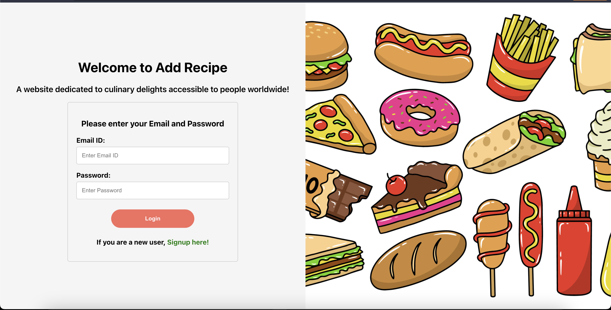

# AddRecipe: A website dedicated to culinary delights accessible to people worldwide

# Backend Repo:

https://github.com/badri119/Add-Recipe-Backend

# Demo:

<a href="https://youtu.be/5pODLKL0-cU" target="_blank">AddRecipe Tutorial</a>

# Technical Details:

- The Application was built using Reactjs, Expressjs, Nodejs and MongoDB
- Impleneted JWT for secure Authentication
- Employed hashing to encrypt the password and saved it in the database
- Used Axios for API calls
- Implemented Docker for containerizing and deploying the MERN stack application, ensuring consistent environments

# Key Features:

- Signin and Signup
- Credientials are encrypted on a database level
- Ability for users to View, Add, Delete and Edit recipes based on their preference
- Mobile Responsive

# Future Improvements:

- Upcoming features will include a notes section where users can write custom notes for reference
- Favorite a recipe

# API endpoints:

| Endpoint      | Method | Description              |
| ------------- | ------ | ------------------------ |
| /recipes      | GET    | Get all Recipes          |
| /signup       | POST   | Sign up new User         |
| /signin       | POST   | Signs in a User          |
| /recipes/post | POST   | Adds a new Recipe        |
| /recipes/:id  | GET    | Gets a specifc Recipe    |
| /recipes/:id  | PATCH  | Edits a specifc Recipe   |
| /recipes/:id  | Delete | Deletes a specifc Recipe |

# How to start the project:

# Frontend

1. Clone the Frontend Repository and install all the required dependencies using 'npm install'
2. To run the frontend without backend use 'npm start'.

# Backend

1. Clone the Backend Repository and install all the required dependencies using 'npm install'
2. MongoDB Setup:
   - Make sure MongoDB is installed on your machine or use a cloud-based MongoDB service.
   - Create a MongoDB database and note its connection URL.
3. Environment Variables:
   - Create a .env file in the root of your project
   - Add the MongoDB connection URL and any other environment variables needed.
     - Example or refer .env.example in the backend repository:
       MONGODB_URI=your_mongodb_connection_url
       TOKEN_SECRET= your_secret_token_key
4. Run npm start for the server to boot up
5. Run npm start for for the client to boot up
